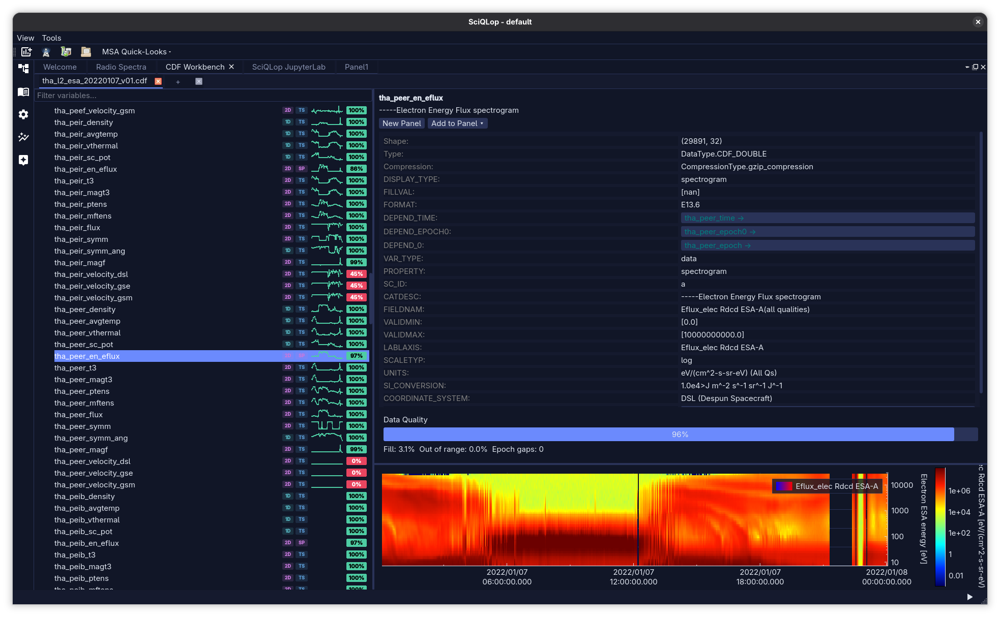

# cdf_workbench

Multi-function CDF file explorer for SciQLop.

## Screenshots

Browse a CDF's variables (with sparkline previews + data-quality bars),
inspect ISTP metadata, and plot straight onto a panel:



## What it does

Open a CDF (local path, URL, or raw bytes via `pycdfpp`) and get a
workbench dock for it:

- **Variable tree** — every variable with its rank (1D/2D), display kind
  (time-series / spectrogram), a sparkline preview, and a per-variable
  **data-quality score** (fill fraction, out-of-range, epoch gaps).
- **Inspector** — the full ISTP attribute set for the selected variable
  (DEPEND_*, FILLVAL, VALIDMIN/MAX, UNITS, SCALETYP, CATDESC, …) with
  clickable DEPEND links, plus a live preview plot.
- **Plotting** — *New Panel* / *Add to Panel* drops the variable onto a
  SciQLop panel as a first-class product.
- **ISTP conformance** — AstraLint checks flag metadata issues.

## Usage

1. Open SciQLop. A "CDF Workbench" dock appears (toolbar / Tools menu).
2. Open a `.cdf` (local or URL). Filter variables, click one to inspect
   its metadata + preview, then *New Panel* / *Add to Panel* to plot it.

## Development

```bash
pip install -e .
pytest cdf_workbench/cdf_workbench/tests/
```
