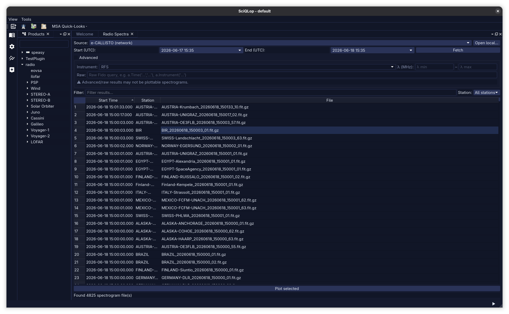
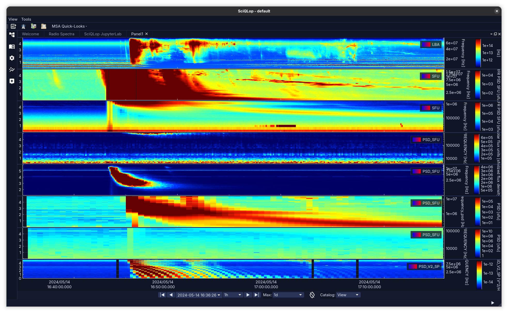

# sciqlop_radio

Heliospheric radio dynamic-spectra browser for SciQLop (wraps `sunpy.radiospectra`).

## Screenshots

Search and fetch ground-based / spacecraft radio spectrograms via Fido:



Drag the fetched products onto a panel and pan/zoom — data is fetched on demand:



## What it does

Two complementary ways to get radio dynamic spectra into SciQLop:

1. **Radio Spectra dock** — a Fido search/fetch UI over the
   `radiospectra` clients (e-CALLISTO, RSTN, EOVSA, I-LOFAR). Search a
   time range, filter the results by station/substring, and plot. Each
   fetched result is auto-exposed as a **live per-channel stream**
   (station + receiver/focus code), so dragging it to any time range
   re-fetches that exact channel on demand.
2. **Curated catalog** — calibrated Speasy-backed dynamic-spectra
   products (PSP/FIELDS RFS, STEREO/SWAVES, Solar Orbiter/RPW, Wind,
   Cassini, Galileo, Voyager, Juno) registered as first-class SciQLop
   virtual products under the `radio/` tree.

Local files (`.cdf`, `.fits`, `.srs`, Wind `.r1/.r2`, I-LOFAR `.dat`)
can be opened directly via *Open local…*.

## Caching

Remote work is cached so panning/re-visiting is cheap:
- File parse → `SpeasyVariable` is cached on disk (Speasy `@CacheCall`,
  keyed on path/mtime/size); LOFAR FITS is cached by URL.
- The continuous-stream callback's `Fido.search` is cached per UTC day
  (deterministic buckets, trimmed to the visible window), so panning
  within a day doesn't re-hit the archive.

## Usage

1. Open SciQLop. A "Radio Spectra" dock appears (toolbar / Tools menu).
2. Pick a **Source** (e.g. e-CALLISTO), set Start/End (UTC), hit *Fetch*.
3. Filter the result table by substring or station; select rows and
   *Plot selected* — or expand the `radio/` product tree and drag a
   curated/streamed product onto any panel.

## Development

```bash
pip install -e '.[test]'
pytest sciqlop_radio/tests/             # mocked tests
pytest sciqlop_radio/tests/ -m live     # live Fido tests (slow, network)
```

Requires `radiospectra>=0.7.0` + `sunpy[net]>=7` (Python ≥3.12).
